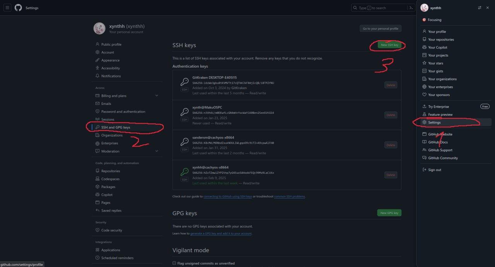
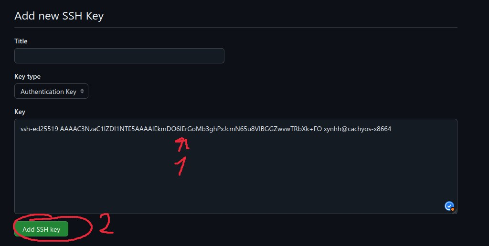
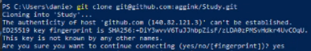

# guide-for-fucking-retarded

## 1. Как установить git на Windows (люди Linux сами разберутся)

### Установка через winget
Альтернативно, можно установить через winget (менеджер пакетов Windows) в PowerShell (От имени администратора):
```bash
# Установка VS Code
winget install Microsoft.VisualStudioCode

# Установка Git
winget install Git.Git
```

<details>
<summary>Обычная установка (если не работает winget)</summary>

1. Скачиваем и устанавливаем VS Code: https://code.visualstudio.com/
2. Скачиваем и устанавливаем git: https://git-scm.com/downloads/win
    - При установке git, следуйте стандартным настройкам, нажимая "Next" на каждом шаге. На шаге выбора редактора по умолчанию можете выбрать VS Code, который мы установили ранее.
</details>

### Настройка после установки
После установки git, открываем терминал PowerShell или CMD и выполняем следующие команды:
```bash
# Проверяем версию git
git --version
# Вводим свои данные
git config --global user.name "Ник на GitHub"
git config --global user.email "Ваша почта"
```

## 2. Создать ssh ключ для GitHub
В терминале PowerShell или CMD выполняем следующие команды:
```bash
# Генерируем ssh ключ, нажимаем Enter на все вопросы
ssh-keygen 
# Копируем содержимое ключа в буфер обмена
cat ~\.ssh\id_ed25519.pub
```
Дальше заходим на GitHub, в настройках профиля находим "SSH and GPG keys", нажимаем "New SSH key", вставляем ключ и сохраняем, как показано ниже:<br>
<br>


## 3. Как клонировать репозиторий
1. Заходим на GitHub, находим нужный репозиторий, нажимаем "Code" и копируем ссылку SSH!!! не HTTPS.
2. В терминале PowerShell или CMD выполняем следующие команды:
```bash
# Переходим в папку, где хотим клонировать репозиторий
cd ..
# Клонируем репозиторий
git clone git@....
# Дальше появится вопрос, вводим "yes" и нажимаем Enter (фото ниже)
```


## 4. Позравляю, вы установили git и клонировали репозиторий. Теперь вы можете работать с git.